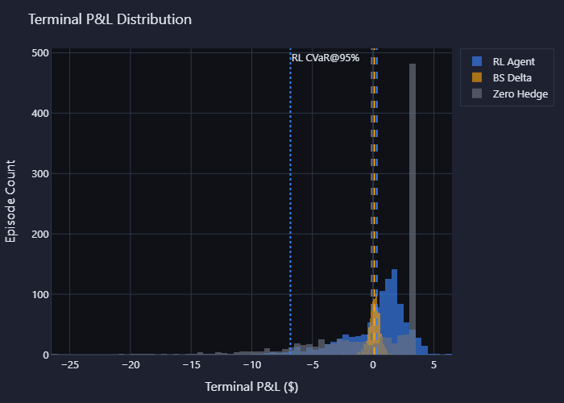

# RL Derivative Hedging

Reinforcement learning agent for hedging a short European call option under
discrete rebalancing and proportional transaction costs. The SAC policy is
benchmarked against Black-Scholes delta hedging and a zero-hedge baseline.

## The Problem

When a desk sells a call option, it takes on exposure to the underlying asset.
Black-Scholes delta hedging gives the number of shares to hold under idealised
assumptions: continuous rebalancing, zero transaction costs, and constant
volatility.

This project relaxes those assumptions. The agent hedges at discrete time steps,
pays transaction costs, observes a simulated market state, and is rewarded by
the P&L of the hedged short-option portfolio after costs.

## Key Results

Full evaluation run: `results/phase6_eval_1000/`, 1,000 shared-seed episodes per
policy using checkpoint `checkpoints/sac_hedging_20260721_002714/best_model.zip`.

| Metric | RL Agent | BS Delta | Zero Hedge |
|--------|----------|----------|------------|
| P&L Std Dev (lower is better) | 2.563 | 0.449 | 4.552 |
| CVaR @ 95% (higher is better) | -6.815 | -0.939 | -13.156 |
| Mean Tx Cost (lower is better) | 0.192 | 0.224 | 0.000 |
| Improvement vs BS | -470.7% std | baseline | n/a |



The current SAC checkpoint reduces average transaction cost by 14.4% versus
Black-Scholes delta, but it does not beat the analytical baseline on P&L
variance or tail risk. The agent has learned to trade less aggressively, but the
reduced trading cost is not enough to offset the larger hedge error.

See [RESULTS.md](RESULTS.md) for the full comparison and robustness tables.

## Architecture

```text
Simulation (GBM) -> Gymnasium Env -> SAC Agent -> Evaluation -> Dashboard
      |                 |                            |
Black-Scholes      Reward: P&L             RL vs BS Comparison
Greeks             minus tx cost           Robustness Tests
                                           Plotly Charts
```

Two separations are intentional:

- Finance utilities are pure NumPy/SciPy code and do not depend on RL modules.
- The Gymnasium environment is consumed by training and evaluation, but does not
  know about Stable-Baselines3 configuration.

## Setup

Requirements: Python 3.11+ and pip.

```bash
git clone https://github.com/yourusername/rl-derivative-hedging
cd rl-derivative-hedging
pip install -e .
pip install -r requirements-dev.txt
```

## Usage

### 1. Train

```bash
python -m src.training.train --config configs/training.yaml
tensorboard --logdir results/
```

Checkpoints are saved under `checkpoints/<run>/`; TensorBoard logs are saved
under `results/<run>/`.

### 2. Evaluate

```bash
python -m src.evaluation.evaluate \
    --checkpoint checkpoints/<run>/best_model.zip \
    --vecnorm checkpoints/<run>/best_vecnorm.pkl \
    --n-episodes 1000
```

Evaluation outputs include `episode_data.csv`, `step_data.csv`, `metrics.json`,
`robustness.csv`, and Plotly HTML/PNG charts under `results/<evaluation_run>/`.

### 3. Dashboard

```bash
streamlit run src/dashboard/app.py
```

Open `http://localhost:8501`, select a saved evaluation run, and inspect the
overview, P&L analysis, episode replay, experiment table, and training logs.

### 4. Hyperparameter Search

```bash
python -m src.training.hpo --trials 20 --storage sqlite:///hpo.db
```

The HPO module uses Optuna with a TPE sampler and median pruner. Each trial
trains SAC for a reduced budget and evaluates the resulting policy.

## Project Structure

```text
rl-derivative-hedging/
|-- configs/              YAML training configuration
|-- src/
|   |-- finance/          Black-Scholes pricing, Greeks, transaction costs
|   |-- simulation/       GBM price-path generator
|   |-- envs/             Gymnasium hedging environment
|   |-- training/         SAC training, env factory, callbacks, HPO
|   |-- evaluation/       Backtest, metrics, robustness, Plotly charts
|   `-- dashboard/        Streamlit dashboard
|-- tests/                Pytest suite with coverage gate
|-- notebooks/            Mathematical exploration notebook
|-- checkpoints/          Saved models and VecNormalize stats, git-ignored
`-- results/              Evaluation outputs and plots, git-ignored
```

## Design Decisions

**SAC over PPO:** SAC handles continuous actions directly and uses replay-buffer
sample reuse, which is useful for a low-dimensional continuous-control problem.

**VecNormalize saved with every model:** Observation and reward normalisation are
part of the trained policy state. Evaluation loads matching VecNormalize stats
alongside the SAC checkpoint.

**Shared seeds for baseline comparison:** RL, Black-Scholes delta, and zero hedge
are evaluated on identical price paths for each episode seed.

**Streamlit over React:** The dashboard is a local analysis tool. Streamlit and
Plotly keep the project Python-native while still supporting interactive charts.

## Known Limitations

- Price paths are simulated with GBM only; jumps, stochastic volatility, and fat
  tails are not modelled.
- The option tested is a European call on a single underlying.
- No real market data is used.
- The current SAC checkpoint is undertrained relative to the analytical baseline
  on risk metrics; more training or HPO is needed before claiming improvement.
- Transaction costs are proportional only and do not include nonlinear market
  impact.

## Project Status

- Phase 0: project skeleton and tooling
- Phase 1: Black-Scholes pricing, Greeks, and GBM simulation
- Phase 2: Gymnasium hedging environment
- Phase 3: SAC training pipeline
- Phase 4: evaluation and robustness pipeline
- Phase 5: Streamlit dashboard
- Phase 6: HPO, quality gates, documentation, and notebook polish

## References

- Whalley and Wilmott (1997), transaction-cost option hedging
- Halperin (2020), QLBS: Q-Learner in the Black-Scholes Worlds
- Kolm and Ritter (2019), dynamic replication and hedging with RL
- Cao et al. (2020), Deep Hedging of Derivatives Using Reinforcement Learning
- Haarnoja et al. (2018), Soft Actor-Critic
